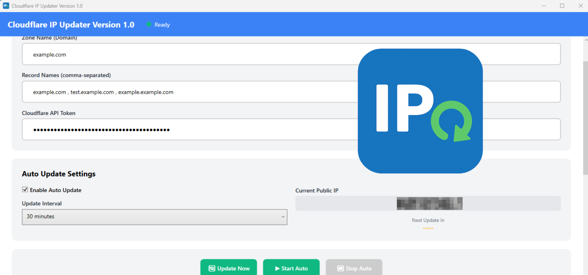

# Cloudflare IP Updater

---

## ภาษาไทย 🇹🇭

**Cloudflare IP Updater** คือโปรแกรมที่ช่วยอัปเดต IP แบบไดนามิกของคุณบน Cloudflare DNS โดยอัตโนมัติ ทำให้โดเมนของคุณชี้ไปยัง IP ที่ถูกต้องอยู่เสมอ เหมาะสำหรับผู้ใช้ที่มี IP แบบไดนามิก, เซิร์ฟเวอร์ที่บ้าน หรือบริการที่ต้องการอัปเดต DNS อย่างต่อเนื่อง

### คุณสมบัติ
- ตรวจสอบ IP ปัจจุบันและอัปเดต DNS ของ Cloudflare อัตโนมัติ  
- รองรับการจัดการหลายโดเมนและซับโดเมน  
- ใช้ Cloudflare API token อย่างปลอดภัย โดยไม่เก็บรหัสผ่าน  
- ตัวโปรแกรมเบาและทำงานเบื้องหลัง ใช้ทรัพยากรน้อย  
- อินเตอร์เฟซใช้งานง่าย พร้อมสถานะและบันทึกการทำงาน  

### ดาวน์โหลด
ดาวน์โหลดเวอร์ชันล่าสุดได้ที่ GitHub Release:

- [ดาวน์โหลด Windows .EXE](https://downloadcloudflare-ip-updater.weerapatserver.site)  
- [ดาวน์โหลด Portable .ZIP](https://downloadcloudflare-ip-updater.weerapatserver.site)  

### วิธีใช้งาน
สำหรับคู่มือแบบละเอียด:  
[ดูวิธีใช้งาน Cloudflare IP Updater (ภาษาไทย)](https://weerapatserver.site/HowToUse-Cloudflare-IP-Updater-TH.html)  

#### ขั้นตอนสรุป
1. ดาวน์โหลดไฟล์ `.exe` หรือ `.zip`  
2. รันโปรแกรมบน Windows 10/11 หรือ Windows Server  
3. โปรแกรมจะทำงานเบื้องหลังและอัปเดต IP ของคุณบน Cloudflare อัตโนมัติ 

### คำถามที่พบบ่อย (FAQ)
**Q: ต้องมี IP แบบคงที่ไหม?**  
A: ไม่ โปรแกรมนี้ออกแบบมาสำหรับ IP แบบไดนามิก  

**Q: บัญชี Cloudflare จะปลอดภัยไหม?**  
A: ใช่ ใช้ API token อย่างปลอดภัยและไม่เก็บรหัสผ่าน  

**Q: สามารถจัดการหลายโดเมนได้ไหม?**  
A: ใช่ จัดการหลายโดเมนและซับโดเมนได้อย่างง่ายดาย  

---

## English 🇬🇧

**Cloudflare IP Updater** automatically updates your dynamic IP address on Cloudflare DNS, ensuring your domain always points to the correct IP. Ideal for users with dynamic IPs, home servers, or anyone running services that require continuous DNS updates.

### Features
- Automatically detects your current IP and updates Cloudflare DNS records  
- Supports managing multiple domains and subdomains  
- Uses Cloudflare API token securely without storing passwords  
- Lightweight program, runs quietly in the background with minimal resources  
- User-friendly interface with status updates and log tracking  

### Download
Get the latest version from GitHub Release:

- [Download Windows .EXE](https://downloadcloudflare-ip-updater.weerapatserver.site)  
- [Download Portable .ZIP](https://downloadcloudflare-ip-updater.weerapatserver.site)  

### How to Use
For detailed guide:  
[See How to Use Cloudflare IP Updater (English)](https://weerapatserver.site/HowToUse-Cloudflare-IP-Updater-EN.html)  

#### Quick Steps
1. Download the `.exe` or `.zip` file  
2. Run the program on Windows 10/11 or Windows Server  
3. The program will run in the background and update your IP on Cloudflare automatically  

### Frequently Asked Questions (FAQ)
**Q: Do I need a static IP?**  
A: No, this tool is designed for dynamic IPs  

**Q: Is my Cloudflare account safe?**  
A: Yes, it uses API tokens securely without storing passwords  

**Q: Can I manage multiple domains?**  
A: Yes, you can easily manage multiple domains and subdomains  

---

© 2025 Cloudflare IP Updater. All rights reserved.
